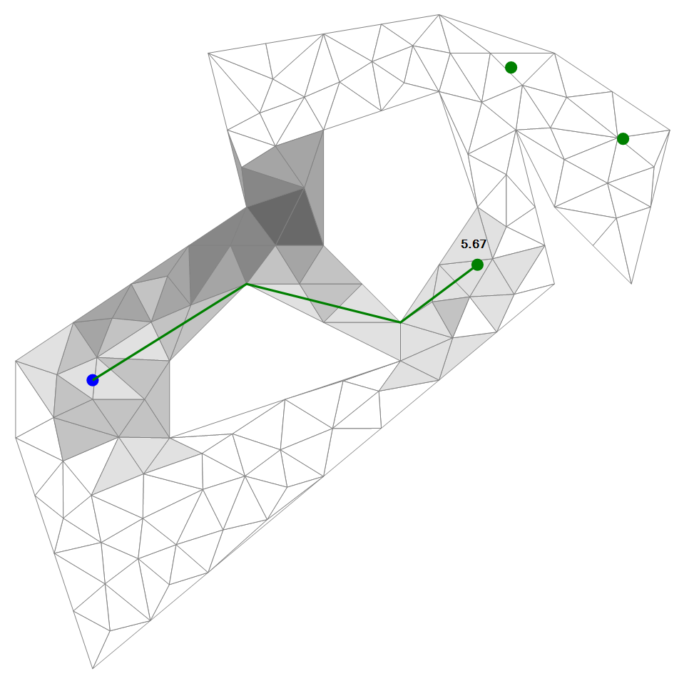

# tpamesh

_Triangulated Polygon A-star for 2D Triangle Meshes_ is an extension of my pathfinder [tpastar](https://github.com/grgomrton/tpastar/) so that it is able to find shortest paths on triangle meshes containing internal triangles.

  

The image shows the result of a pathfinding between one starting point and three target points. The shade of the triangles indicate the number of times the given triangle was expanded. 

The algorithm works in various arrangements:

|  |  |  |
|:-:|:-:|:-:|
| The result of a pathfinding on a lowpoly triangulated polygon | The result of a pathfinding on a Delaunay triangulated polygon where added points lie only on boundaries | The result of a pathfinding on a polygon mesh where added points lie inside the polygon boundaries |

The performance of the algorithm depends on the amount of triangles, as well as on the length of the path.

## Licensing

This repository contains the implementation of the algorithm in C#.

The project is licensed under 

## Contact

Do you use tpamesh for something cool? [Get in touch](mailto:grgo.mrton@gmail.com).

## Acknowledgements
- _Jonathan Shewchuk_, whose library, Triangle was used to triangulate polygons and generate meshes for the demo application
